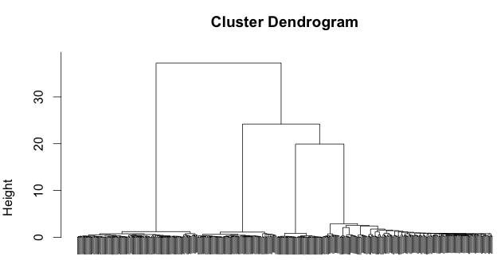
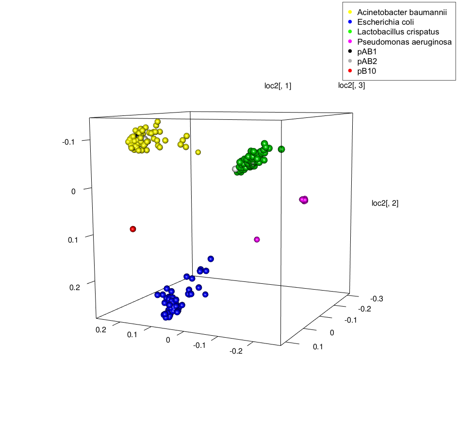

This is a workflow for using Hi-C paired end read linkages to cluster metagenomic contigs by 
species. 

Project website and data repository: [Using Hi-C to Track Plasmids and Antibiotic
Resistance in Microbial Communities](https://osf.io/gr2d7/)

By Elle J. Kohler, kohl5779@vandals.uidaho.edu

Project paper: link and citation coming soon

## Overview
Prior to performing contig clustering based on Hi-C read linkages, metagenomic shotgun 
reads must be cleaned and assembled into contigs and the Hi-C reads must be cleaned. See 
[project website](https://osf.io/7n8rx/wiki/home/) for how to complete the first two steps. 
Tutorials for those two steps are given using microbial Community 4a 
and a tutorial for the third step of the analysis pipeline, clustering metagenomic contigs 
based on Hi-C read linkages, is given here for the same sample, [Community 4a](https://osf.io/zacf7/). 

Step 2, the Hi-C read cleaning, results in an alignment file called: **hicup.sam**, that 
gives alignments specifying which contig each end of each Hi-C read aligns to. This is 
the data file used for the Hi-C cluster analysis that is done in R.

## Data prep
The file: [hicup.sam](https://osf.io/prnvy/), is too large to easily maneuver in R and 
only a small percentage of its information is actually needed as input. For this project 
the important data was extracted using the script available on this page, **Matrix.py**. 
**Matrix.py** should be downloaded, made an executable script, and implemented in the 
command line using the command:

```> python2.7 Matrix.py hicup.sam > Comm4a_interactions.csv```

This extracts column 3 of **hicup.sam**, which lists the contigs the Hi-C reads aligned to, 
in a short format. Alternatively this third column could be extracted any way you choose as 
the short format was only chosen for aesthetics and to make the produced tables a bit 
easier to read. The intermediary file **Comm4a_interactions.csv** can be downloaded 
[here](https://osf.io/prnvy/) if one wishes to move straight to trying the clustering script.

## R: build Hi-C interaction matrix
Download the script **HiCclust.R**. The first step in running it will be to install the 3 
packages listed. Next there are 2 variables to set up. First one must specify the number 
of valid and unique Hi-C reads in the dataset. Using output from Step 2 of this analysis 
pipeline, Hi-C Read Cleaning, the number of valid and unique Hi-C reads
can be found at the bottom of **AD004_S2_R1_2_001.HiCUP_summary_report.html**. For 
Community 4a, this number is: 5911667. The next piece of information that needs filled in is 
the path to the file **Comm4a_interactions.csv** (where it is stored on your computer).

Now you can run the section of script called "build symmetrical matrix of Hi-C interactions". 
If you're working in Rstudio, you'll see a lot of objects added to your environment. Clicking 
on the one called: **imat**, shows the matrix of contigs with the numbers of Hi-C reads 
linking each contig pair.

## R: perform hierarchical clustering
Next run the 3 lines under the heading "perform clustering". This is done using the R 
[hclust](https://stat.ethz.ch/R-manual/R-devel/library/stats/html/hclust.html) command 
and will produce a dendrogram that looks like this: 

For this example and all other samples run in our study, the dendrogram clearly shows the 
likely number of genomic clusters in the sample. Here there are 4 clear branches on the 
tree. This number must be manually input into the next section of code, "input k". There is 
also the option to save a file to your Desktop listing which cluster number each contig 
got assigned to. It is described later how to use this file, called **clusters.txt** to 
separate the clusters of contigs into separate files to be used in downstream analysis.

## R: species identification
The next section of the script (lines 45-63 of **HiCclust.R**) computes some statistics on 
the clusters, such as which reference genomes the contigs in each cluster align to best and 
how many contigs in the dataset did not align to any of the provided reference genomes. It 
also creates a dataset that can be used to color the data points (contigs) in the dendrogram 
or following principle coordinate (PCo) plots by species as determined by alignment to 
reference genomes. The object, **dataset** produced by this portion of the script can also 
be useful to scroll through as it lists each contig and which cluster and which reference 
genome it belongs to. This portion of the script requires the input file, **outfile1**, 
made available on this page.

If you wish to reproduce the file yourself, **outfile1** was created by aligning all of 
the contigs to a compilation of reference genomes 
containing all the replicons known to be in the sample. The species and plasmids present in 
sample Community 4a are listed [here](https://osf.io/zacf7/wiki/home/). The reference 
genomes for these replicons can be collected [here](https://osf.io/xv3ud/) or pulled from 
the NCBI reference database. The required references should be concatenated into a single 
file called Comm4aref.fasta. The NCBI blast tool can then be used to perform the alignment. 
First turn the contigs into a database:

```> makeblastdb -dbtype nucl -in longcontigs.fasta -hash_index```

Then blast the file of combined reference sequences against the assembled contigs:

```> blastn -query Comm4aref.fasta -db longcontigs.fasta -outfmt 6 -evalue 0.0001 -out outfile -max_hsps 1```

The output from this command will be a file that again contains more information than is 
needed as input into R. The necessary information for script **HiCclust.r** being only 
columns 1, 2, and 4 of the **outfile**. These columns can be extracted using the command:

```> awk '{print$1,$2,$4}' outfile > outfile1```

**outfile1** can then be used as the input for this portion of the R script. Remember to 
specify the path to this file.

## R: visualization in PCo space
There is next the option to look at the clusters in 2D or 3D principle coordinate (PCo) space.
In this script the default is to color the contigs by species identity as was determined
by aligning the contigs to reference genomes. I usually jump right to viewing the clusters
in 3D PCo space as this visual is more informative (lines 72-78). If working on a Mac you may 
need to install [XQuartz](https://www.xquartz.org/) before being able to view 3D plots. 
XQuartz must already be open and running in the background any time this portion of the script is run (lines 71-77). 
After manually setting the plot to the desired size and direction there are the options 
to add a legend or take a snapshot of the 3D figure producing something like this: 


The following section of code (lines 91-96) show how to manually set the colors to something 
different. If you supply a vector of desired colors, you can then scroll back up to any of 
the plot commands and change the line "col = as.numeric(dataset$V1)+**some number**" to 
simply "col = as.numeric(dataset$V1)" and the plot will use the colors you specified.

## R: determine hosts of specific plasmids
One of the potentially most useful analyses described in the published paper was determining 
the host(s) of plasmids in a Hi-C sample based on the numbers of Hi-C interactions the plasmid 
had with each species in the sample. To do this, it is necessary to identify a contig bearing 
plasmid sequence (the longer the better) and find its row number in the object, **dataset**. 
For Community 4a, the one plasmid pB10 contig is located on row 431 of **dataset**. This 
value gets input in line 100 of the script and gets run with the rest of the section. This 
will produce three tables. The first will list the raw counts of how many Hi-C reads link 
pB10 with each of the four genomic clusters. The second lists how many total Hi-C reads align 
to each of the clusters. The values in these tables are both somewhat dependent on genome 
size and how well the replicons were picked up by Hi-C. The third table was what was 
provided in the published results and lists the percentages of the total Hi-C reads 
aligning to each genome cluster that were Hi-C linkages to pB10. The true hosts of the plasmid 
had values in this table that were an order of ten higher than those percentages associated 
with the background species.

## Downstream cluster analysis
If you previously saved the file, **clusters.txt**, that lists which cluster each contig 
was assigned to based on hierarchical cluster, you can use it and the script, **Clusters.py**, 
to separate the file of total contigs, **longcontigs.fasta** into multiple smaller files of 
contigs, one for each cluster. This can be done using the command:

```> python2.7 Clusters.py clusters.txt longcontigs.fasta```

This will automatically create and name 4 files that will be output into whatever directory 
you are currently working in. Note that this command will automatically create as many 
contig files as there were clusters (the value chosen for k). These files each represent a 
genome as determined by the hierarchical clustering based on Hi-C linkages. They can be used 
to align to reference sequences in order to determine how much of each species genome was 
recovered or used for blast type analysis methods.

An example of some blast searches that I used for tracking antibiotic resistance genes 
(ARG) and plasmid identifier genes within the clusters were the online search tools: 
[ResFinder](https://cge.cbs.dtu.dk/services/ResFinder/) and 
[PlasmidFinder](https://cge.cbs.dtu.dk/services/PlasmidFinder/). Either the file of total 
contigs, **longcontigs.fasta**, or the individual genome cluster files can be uploaded to 
these sites and compared to their databases of ARG and plasmid identifier genes to get a 
quick look at who may be carrying what. I recommend

## Using HiCclust.R to cluster unknown communities
While the community composition of sample Community 4a was known prior to analysis, this 
analysis method could also be used for samples with unknown compositions as described in 
the project paper. This would require a few changes to the method. For example, after 
making the first dendrogram, if there were more species present, it might be difficult to 
determine the optimal number of genomic clusters through visual analysis. Other methods 
might need to be employed to choose a value for k, such as silhouette plot analysis. The 
end of the script **HiCclust.R** (lines 114-119) includes a section on using silhouette 
plots to determine the optimal number of clusters. This can be tested on Community 4a to 
verify that the optimal number of clusters is indeed 4. 

A second change that would need to be made is to the method for identifying contigs. The 
current script is set up to use **outfile1** to identify the contigs and color the plots 
by species identity. The contigs could be identified many different ways. A file similar 
to **outfile** could be created by blasting all of the contigs against NCBI's total refseq 
genomic database instead of only against references for the replicons known to be present 
in the sample. The names of the species they aligned to might need to be parsed so as to 
include only the species names and not strains. As it is likely that contigs would align 
well to multiple strains within their species, the R script would see each different strain 
as a completely different variable and might color one _E. coli_ cluster five different 
colors, for instance, if the contigs in the cluster aligned to five different strains. If 
coloring the plots by species was not necessary, another identification method that could 
be used is using the file produced early in the script, **clusters.txt**, alongside the 
script, **Clusters.py**, to separate the contigs from each genomic cluster into individual 
files. These files might then be more easily analyzed and the species within them determined.
